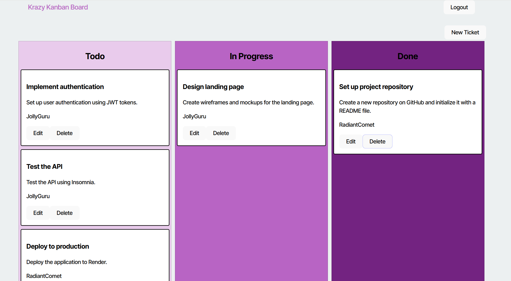

# Kanban Board

# Table of Contents
1. [Description] (#description)
2. [Installation] (#installation)
3. [Usage] (#usage)
4. [Collaborators] (#collaborators)
5. [Contact] (#contact)

## Description
This allows users to login and create To-Do lists that are able to be marked as In-Progress and Done. If user decides it is not needed, can delete out To Do objective.

## Installation
Just head to the website!
https://kanban-board-5gqw.onrender.com

## Usage
Just log in and create your To Do lists

## Collaborators
Collaborator with a previous cohort student, Xpert Learning AI

## Contact
Email: dkobes15@gmail.com
GitHub: https://github.com/Dkobes/Kanban-Board